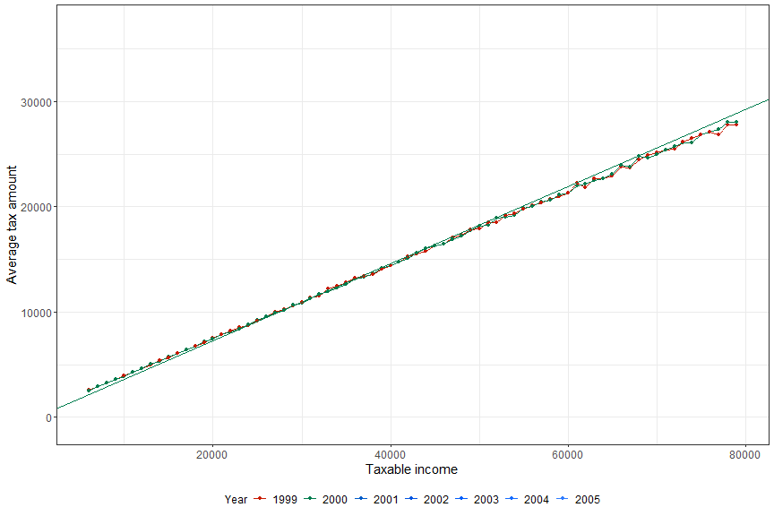
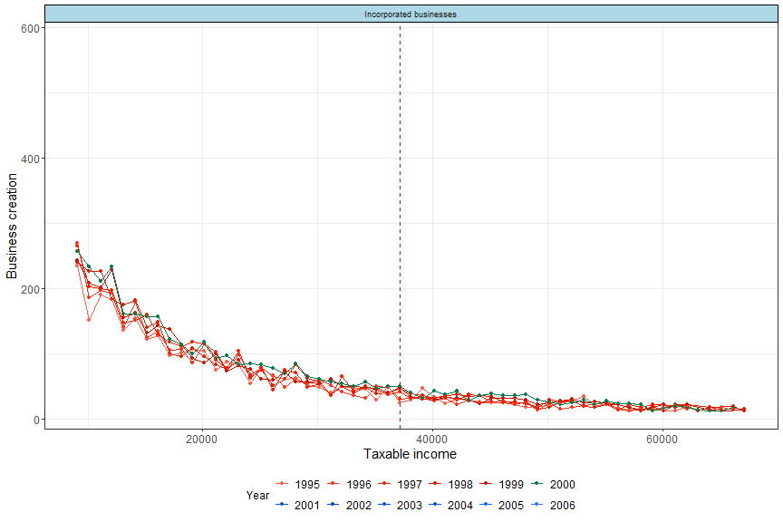

I am a 4th year PhD candidate at [CREST](https://crest.science/), [ENSAE Paris](https://www.ensae.fr/en/), [Institut Polytechnique de Paris](https://www.ip-paris.fr/en) under the supervision of [Pierre Boyer](https://pierrecboyer.com/) and [Michael Visser](https://faculty.crest.fr/mvisser/) since September 2022. 

My research lies in the field of **Public Economics** where I especially study the different channels through which taxes affect corporate behavior using both theory and empirical analysis.

I am on the **2025/2026 academic job market**.

I visited the **University of California, Berkeley**, hosted by **Emmanuel Saez** during the **2025 Spring semester**.

References
&nbsp;<a href="https://pierrecboyer.com/">Pierre Boyer</a>&nbsp; <a href="https://faculty.crest.fr/mvisser/">Michael Visser</a>  &nbsp;<a href = "https://www.bertrandgarbinti.com/">Bertrand Garbinti</a>&nbsp;<a href="https://eml.berkeley.edu/~saez/">Emmanuel Saez</a>

<!-- Secondarily, in studying robust and generalized econometric techniques such as partial identification or non-parametric econometrics, in order to apply them in my research. Additionally, I am curious about the Theory of the Firm and the way one can model production functions. -->
__Contact__: [theo.valentin@ensae.fr](theo.valentin@ensae.fr)

## Job Market Paper

* **Non-linear Corporate Income Tax: Learning, Intensive and Extensive Margins**\
This paper presents new evidence on how corporate income tax (CIT) reforms affect firm behavior. I study a French reform that replaced a linear corporate tax rate with a progressive, bracketed schedule. Using detailed administrative tax data and exploiting a unique institutional feature, I find that between 28% and 48% of small and medium sized businesses are inattentive to tax reforms. By analyzing excess mass around the new tax bracket and comparing attentive and inattentive firms, I estimate the cost of inattention to be 926€ per firm, equivalent to 2.6% of taxable income. Inattention constitutes a major friction that delays behavioral responses in the short run. Once the responses at the threshold have stabilized, I estimate a long-run elasticity of 0.132, indicating that incumbent firms are relatively inelastic with respect to the corporate tax rate. The reform had substantial extensive margin effects. First, unincorporated businesses reacted to the lower average corporate tax rate by incorporating and by splitting revenues across multiple entities. Although this response is highly sensitive, rising by 45%, its overall magnitude remains limited. Second, I find a sizeable business creation effect. Using a two-way fixed effects PPML event-study design combined with treatment intensity variation at the county level, I estimate the increase in business creation to be 102% and an average treatment effect of 15%. Overall, the findings reveal that corporate tax reforms generate a wide range of behavioral responses. Understanding and aggregating these channels is essential to improve the design and evaluation of corporate income tax systems.

Firms' reported tax amount (dotted) and true tax code (plain) before and after the reforms (2001-2002)

  

Business creation by taxable income, across years (pre-reform in red, post-reform in blue)

  

**Paper presented at**: UC Berkeley Public Finance Seminar (Berkeley, 2025), Center for Business Taxation Doctoral Conference (Oxford, 2025), UC Santa Barbara Brown Bag Seminar (Santa Barbara, 2025), University of Utah Lunch Seminar (Salt Lake City, 2025), EEA (Bordeaux, 2025), PSE Applied Economics Seminar (Paris, 2024), CESifo Public Economics Area Conference (Munich, 2024), ZEW Public Finance Conference (Mannheim 2024), The 80th Annual Congress of the International Institute of Public Finance (Prague, 2024)  

## Working papers

* **Charitable Giving, Tax Design, and Tax Consent**, with G. Fack, B. Garbinti, J. Goupille-Lebret\
_This paper examines how the design of tax incentives shapes charitable giving and how non-monetary motives
influence such responses. We exploit the French institutional context, where a wealth tax has existed for decades, and
study three reforms: one that introduced a wealth tax credit for charitable donations and two that altered taxpayers’
eligibility for the wealth tax. Our analysis relies on comprehensive French administrative panel data linking the
universe of income tax returns with the universe of wealth tax returns, containing detailed information on income,
wealth, taxation, and charitable contributions. We document substantial heterogeneity in giving behavior across
the tax schedule and develop a conceptual framework to interpret this heterogeneity. Exploiting variation from the
reforms, we identify the mechanisms driving behavioral responses. We find strong attachment to charitable giving:
despite the availability of lower marginal gift prices, many wealth taxpayers deliberately continue to give at higher
marginal prices. We also provide evidence of differential tax aversion depending on the tax base. Finally, using the
most recent reform, we estimate a tax-price elasticity of total charitable giving of –0.51 among wealth taxpayers._

## Selected work in progress

* **Taxing Digital Addiction**
* **Optimal Corporate Taxation with Welfare Weights**

## Non-academic Publications & Papers
* [En 2020, la chute de la consommation a alimenté l’épargne, faisant progresser notamment les hauts patrimoines financiers : quelques résultats de l’exploitation de données bancaires](https://www.insee.fr/fr/statistiques/5232043?sommaire=5232077), with [Odran Bonnet](https://www.odranbonnet.com) and Tom Olivia, Note de conjoncture, 2021 (available in english [here](https://www.insee.fr/en/statistiques/5351886?sommaire=5233864)).
* [Prédire l’activité économique à partir d’articles de presse](http://jms-insee.fr/jms2022s19_2/), with Stéphanie Himpens and Guillaume Arion, Journées de Méthodologie Statistique de l'INSEE, 2022.
  + [Éclairage - L’activité économique française au travers d’articles de presse](https://www.insee.fr/fr/statistiques/5232051?sommaire=5232077), Note de conjoncture, 2021 (available in english [here](https://www.insee.fr/en/statistiques/5351871?sommaire=5233864)).
<!-- * [Innover dans l'administration avec l'IA et la Data Science](https://www.dailymotion.com/video/x84hp0x), [Datadrink](https://www.etalab.gouv.fr/communaute/) from [Etalab](https://www.etalab.gouv.fr/), with Christine Fong and Ruben Partouche, 2021 -->

## Curriculum Vitae

<iframe src="https://valentintheo.github.io/files/Curriculum_Vitae_woWInP.pdf" width="100%" height="900px">
    
Your browser does not support iframes. 
       <a href="https://valentintheo.github.io/files/Curriculum_Vitae_woWInP.pdf">Download the PDF</a>.

</iframe>

## TA sessions

- [Econometrics - 3A CI/MS](https://www.ensae.fr/courses/156), ENSAE Paris, Pr. Bertrand Garbinti (Graduate level, Fall 2022)
- [Econometrics 1](https://www.ensae.fr/courses/145), ENSAE Paris, Pr. Xavier d'Haultfoeuille (Graduate level, Fall 2022)
- [Econometrics 2](https://www.ensae.fr/courses/150), ENSAE Paris, Pr. Michael Visser (Graduate level, Spring 2022)
- Industrial Organization, Université Paris Descartes, (Undergraduate level, Spring 2021)

